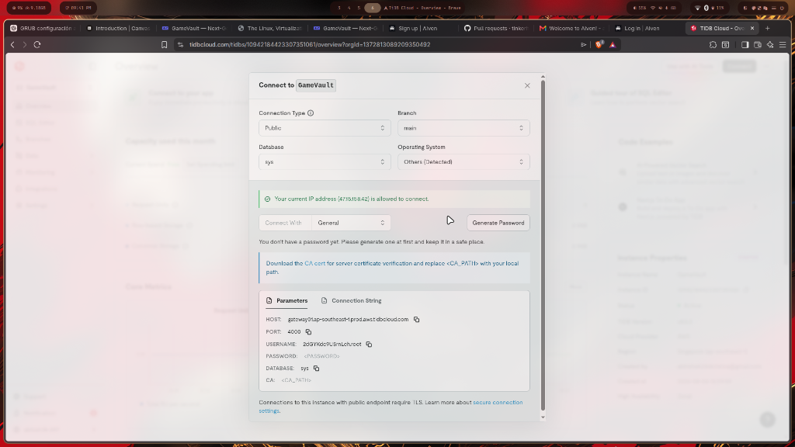
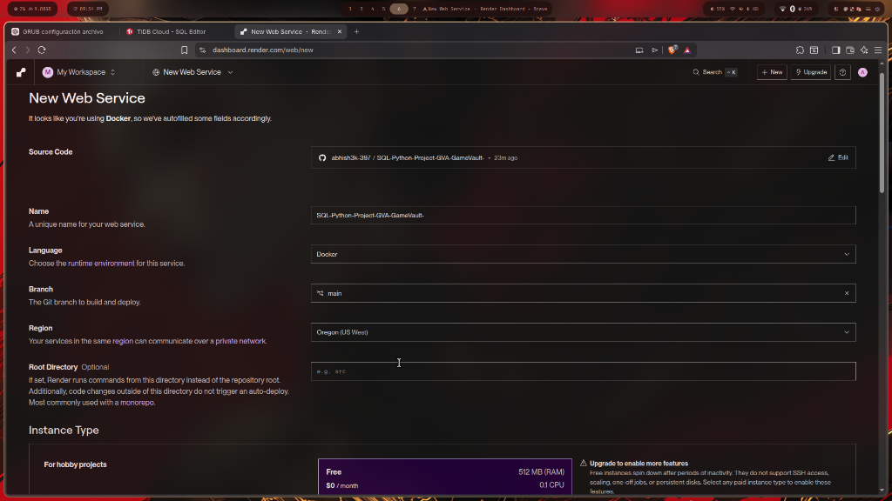
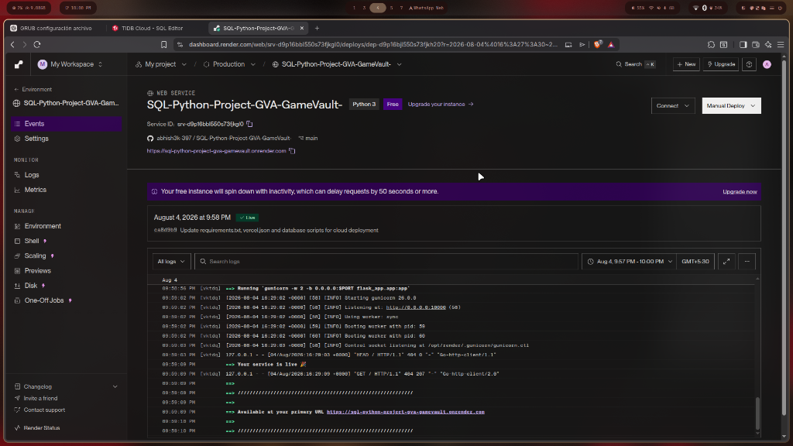
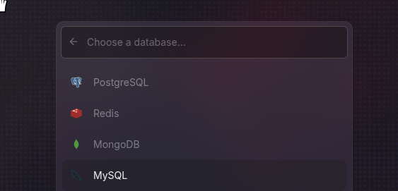
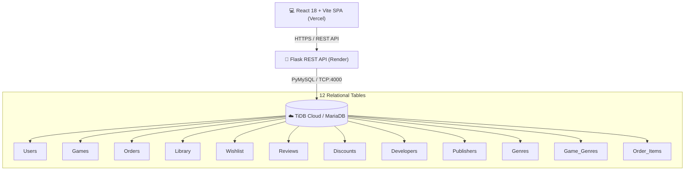
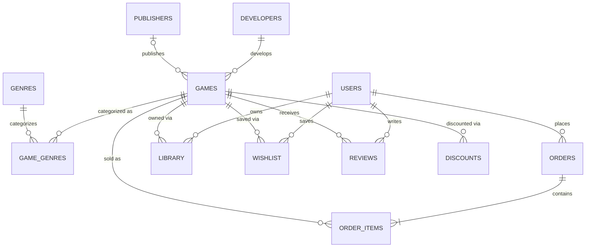

# 🎮 GameVault — Next-Gen Digital Game Store Platform

[](https://www.python.org/)
[](https://flask.palletsprojects.com/)
[](https://react.dev/)
[](https://vitejs.dev/)
[](https://bun.sh/)
[](https://www.mysql.com/)
[](https://tidbcloud.com/)
[](https://www.docker.com/)
[](https://vercel.com/)
[](https://render.com/)

GameVault is a full-stack, enterprise-grade digital distribution platform for video games built with a **Monochrome Dark Mode UI**, **React + Vite + Bun SPA**, **Python Flask REST API**, and a **fully normalized 12-table MySQL / MariaDB relational database**.

---

## 🔗 Live Deployments

- **Frontend (Vercel)**: [https://sql-python-project-gva-game-vault.vercel.app](https://sql-python-project-gva-game-vault.vercel.app)
- **Custom Domain**: [https://gamevault.abhishekcodes.tech](https://gamevault.abhishekcodes.tech)
- **Backend REST API (Render)**: [https://sql-python-project-gva-gamevault.onrender.com](https://sql-python-project-gva-gamevault.onrender.com)
- **Database**: TiDB Cloud (Serverless MySQL 8.0)

---

## 🖼️ Application Screenshots

### 1. Game Catalog & Discovery
*Interactive game store featuring 50 AAA & Indie titles with official Steam CDN header artwork, discounts, and genre filtering.*


---

### 2. Detailed Game View & Customer Reviews
*Deep dive game modal with real-time price calculation, developer metadata, and user reviews.*


---

### 3. User Library & Account Isolation
*Strict user data isolation showcasing personal game library, hours played, wishlist, and wallet balance.*


---

### 4. Dedicated Authentication Portal
*Seamless login and registration portal with session state management.*


---

## 📚 Project Documentation Index

Detailed architectural specifications, data dictionaries, DDL scripts, and analytical queries are housed in the [`docs/`](docs/) directory:

- 📖 **[Database Design & ER Model](docs/DATABASE_DESIGN.md)**: 12-table normalized entity structure (3NF), data dictionary, key business rules, and constraint logic.
- 🛠️ **[SQL Specification & Analytics](docs/SQL_DOCUMENTATION.md)**: Full DDL scripts, database indexes, 7 views, 8 stored procedures, 6 deterministic functions, 7 automated triggers, and 40 analytical queries.

---

## ✨ Features Highlight

### 🛍️ Game Catalog & Discovery
- **50 AAA & Indie Titles**: Populated with iconic games (*The Witcher 3*, *God of War Ragnarök*, *GTA V*, *Hades*, *Balatro*, *Elden Ring*, etc.).
- **Steam CDN High-Res Header Artwork**: Every title maps to official Steam CDN header art URLs (`https://cdn.akamai.steamstatic.com/steam/apps/{app_id}/header.jpg`).
- **Dynamic Discounts & Prices**: Prices listed in Indian Rupees (₹) with real-time active sale calculations.
- **Search & Multi-Genre Filtering**: Real-time client-side search by title, developer, or publisher with genre pills.

### 👤 User Isolation & Authentication
- **Dedicated Authentication Page**: User registration and login flow with session persistence via `localStorage`.
- **Strict Data Isolation**: Separate personal Library, Wishlist, Wallet Balance, and Order History for each user.
- **Role-Based Controls**: Distinct Admin view with platform metrics and purchase protection (Admin cannot purchase games).

### 🛒 Checkout & Order Processing
- **Instant Library Provisioning**: Purchasing a game creates an order, adds the item to the user's Library, and automatically removes it from their Wishlist via database triggers.
- **Wallet & Card Payment Options**: Flexible checkout methods with immediate wallet balance updates.

---

## 🏗️ Architecture & Tech Stack



| Layer | Technology | Description |
|---|---|---|
| **Frontend** | React 18, Vite 5, Bun, Lucide Icons | High-performance single page application built with Tailwind-inspired custom CSS styling |
| **Backend** | Python 3.11, Flask, Gunicorn | Lightweight RESTful microservice handling authentication, transaction routing, and catalog data |
| **Database** | MySQL 8.0 / MariaDB / TiDB Cloud | Relational database engine implementing 3NF schema, stored procedures, triggers, and constraint integrity |
| **DevOps** | Docker, Docker Compose, Nginx | Multi-stage production container build with reverse proxy orchestration |

---

## 🗄️ Database Schema & ER Diagram

GameVault's database consists of **12 normalized tables** designed for high throughput and zero data redundancy.



For table definitions, column types, and constraints, see [docs/DATABASE_DESIGN.md](docs/DATABASE_DESIGN.md).

---

## 🌐 API Reference

The backend provides a complete JSON REST API:

| Method | Endpoint | Description |
|---|---|---|
| `GET` | `/api/health` | Healthcheck and database connectivity test |
| `GET` | `/api/games` | Fetch all catalog games with discounts, genres, and ratings |
| `GET` | `/api/games/<id>` | Fetch detailed metadata for a specific game |
| `POST` | `/api/register` | Register a new user account |
| `POST` | `/api/login` | Authenticate user credentials |
| `GET` | `/api/user/profile?user_id=<id>` | Retrieve user wallet balance and statistics |
| `GET` | `/api/library?user_id=<id>` | Fetch all owned games for a user |
| `GET` | `/api/wishlist?user_id=<id>` | Fetch wishlisted games for a user |
| `POST` | `/api/wishlist` | Toggle addition/removal of a game in wishlist |
| `POST` | `/api/checkout` | Process game purchase, create order, and update library |
| `GET` | `/api/reviews/<game_id>` | Fetch user reviews for a game |
| `POST` | `/api/reviews` | Submit a new user review (requires ownership) |
| `GET` | `/api/admin/stats` | Fetch system-wide revenue, users, and order metrics |

---

## 🚀 Quick Start Guide

### Prerequisites
- **Python 3.10+**
- **Bun** or **Node.js 18+**
- **MySQL 8.0+** or **MariaDB 10.5+** (or TiDB Cloud connection string)

### 1. Clone & Set Up Environment
```bash
git clone https://github.com/abhish3k-397/SQL-Python-Project-GVA-GameVault-.git
cd SQL-Python-Project-GVA-GameVault-
```

### 2. Configure Database Credentials
Set environment variables or edit `database.py`:
```bash
export DB_HOST="gateway01.ap-southeast-1.prod.aws.tidbcloud.com"
export DB_PORT="4000"
export DB_USER="2dGYKdc9USrnLeh.root"
export DB_PASSWORD="YourPassword"
export DB_NAME="test"
```

### 3. Seed Database & Steam Images
```bash
# Provision schema and seed default users
python setup_tidb_cloud.py

# Populate 50 AAA & Indie games
python add_50_games.py

# Update steam CDN image URLs
python update_steam_images.py
```

### 4. Run Backend API
```bash
pip install -r requirements_flask.txt
python flask_app/app.py
```
*Backend will start on `http://localhost:5000`.*

### 5. Run Frontend SPA
```bash
cd frontend
bun install
bun run dev
```
*Frontend will start on `http://localhost:5173`.*

---

## 🐳 Docker Deployment

To run the full stack locally via Docker Compose:

```bash
docker-compose up --build -d
```

Services started:
- **MariaDB Container**: Port `3306`
- **Flask API Container**: Port `5000`
- **Frontend Nginx Container**: Port `80`

---

## 🤝 Contributing & License

Developed for educational and demonstration purposes. Contributions, issues, and feature requests are welcome!

Distributed under the **MIT License**.
