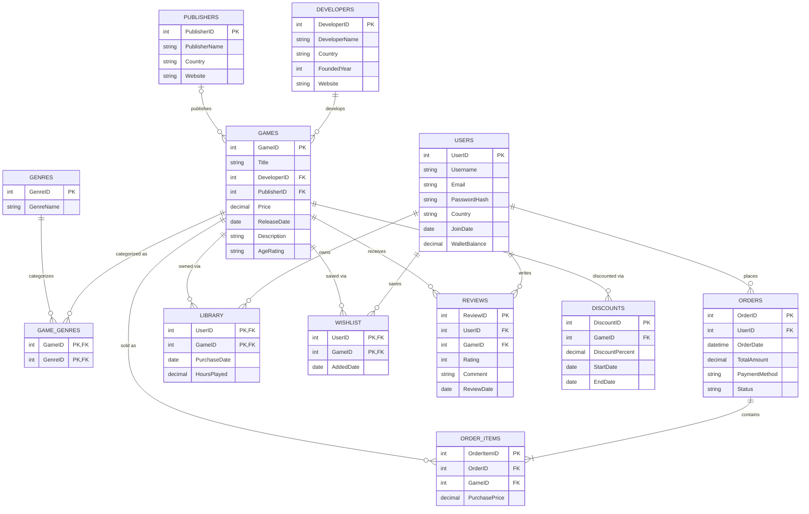

# Game Store Database — Design Document

## 1. Overview

This document defines the relational database schema for an online game
store platform. Users can browse games, purchase them, build a personal
library, maintain a wishlist, leave reviews, and take advantage of
time-limited discounts. Games are attributed to a developer and a
publisher, and are categorized into one or more genres.

The design keeps the original 12-table structure but tightens the
normalization, fixes a few relationship inconsistencies from the draft,
and adds the constraints a grader/professional reviewer would expect to
see (uniqueness rules, check constraints, explicit cardinality and
participation).

**Table count: 12** (within the 12–14 target).

---

## 2. Entity List

| # | Table | Purpose |
|---|-------|---------|
| 1 | `Users` | Registered platform users / customers |
| 2 | `Developers` | Studios that build games |
| 3 | `Publishers` | Companies that publish/distribute games |
| 4 | `Games` | Game catalog |
| 5 | `Genres` | Genre lookup (Action, RPG, Strategy, …) |
| 6 | `Game_Genres` | M:N bridge between Games and Genres |
| 7 | `Orders` | A purchase transaction made by a user |
| 8 | `Order_Items` | Line items belonging to an order |
| 9 | `Library` | Games a user owns after purchase (M:N + metadata) |
| 10 | `Wishlist` | Games a user wants to buy later (M:N + metadata) |
| 11 | `Reviews` | User-submitted ratings/comments on games |
| 12 | `Discounts` | Time-boxed price discounts on games |

---

## 3. Data Dictionary

### 3.1 Users
| Column | Type | Constraints |
|---|---|---|
| UserID | INT | PK, AUTO_INCREMENT |
| Username | VARCHAR(50) | NOT NULL, UNIQUE |
| Email | VARCHAR(100) | NOT NULL, UNIQUE |
| PasswordHash | VARCHAR(255) | NOT NULL |
| Country | VARCHAR(50) | |
| JoinDate | DATE | NOT NULL, DEFAULT CURRENT_DATE |
| WalletBalance | DECIMAL(10,2) | NOT NULL, DEFAULT 0.00, CHECK (WalletBalance >= 0) |

### 3.2 Developers
| Column | Type | Constraints |
|---|---|---|
| DeveloperID | INT | PK, AUTO_INCREMENT |
| DeveloperName | VARCHAR(100) | NOT NULL |
| Country | VARCHAR(50) | |
| FoundedYear | SMALLINT | CHECK (FoundedYear <= YEAR(CURRENT_DATE)) |
| Website | VARCHAR(150) | |

### 3.3 Publishers
| Column | Type | Constraints |
|---|---|---|
| PublisherID | INT | PK, AUTO_INCREMENT |
| PublisherName | VARCHAR(100) | NOT NULL |
| Country | VARCHAR(50) | |
| Website | VARCHAR(150) | |

### 3.4 Games
| Column | Type | Constraints |
|---|---|---|
| GameID | INT | PK, AUTO_INCREMENT |
| Title | VARCHAR(150) | NOT NULL |
| DeveloperID | INT | FK → Developers(DeveloperID), NOT NULL |
| PublisherID | INT | FK → Publishers(PublisherID), NULL allowed (self-published games) |
| Price | DECIMAL(8,2) | NOT NULL, CHECK (Price >= 0) |
| ReleaseDate | DATE | |
| Description | TEXT | |
| AgeRating | VARCHAR(10) | e.g. 'E', 'T', 'M', '18+' |

### 3.5 Genres
| Column | Type | Constraints |
|---|---|---|
| GenreID | INT | PK, AUTO_INCREMENT |
| GenreName | VARCHAR(50) | NOT NULL, UNIQUE |

### 3.6 Game_Genres (junction — M:N)
| Column | Type | Constraints |
|---|---|---|
| GameID | INT | PK, FK → Games(GameID) |
| GenreID | INT | PK, FK → Genres(GenreID) |

*Composite primary key `(GameID, GenreID)` — no surrogate key needed.*

### 3.7 Orders
| Column | Type | Constraints |
|---|---|---|
| OrderID | INT | PK, AUTO_INCREMENT |
| UserID | INT | FK → Users(UserID), NOT NULL |
| OrderDate | DATETIME | NOT NULL, DEFAULT CURRENT_TIMESTAMP |
| TotalAmount | DECIMAL(10,2) | NOT NULL, CHECK (TotalAmount >= 0) |
| PaymentMethod | VARCHAR(30) | e.g. 'Card', 'Wallet', 'PayPal' |
| Status | VARCHAR(20) | NOT NULL, DEFAULT 'Pending' — Pending/Completed/Cancelled/Refunded |

### 3.8 Order_Items
| Column | Type | Constraints |
|---|---|---|
| OrderItemID | INT | PK, AUTO_INCREMENT |
| OrderID | INT | FK → Orders(OrderID), NOT NULL |
| GameID | INT | FK → Games(GameID), NOT NULL |
| PurchasePrice | DECIMAL(8,2) | NOT NULL — price at time of purchase (historical snapshot) |

*Unique constraint on `(OrderID, GameID)` prevents the same game being added twice to one order.*

### 3.9 Library
| Column | Type | Constraints |
|---|---|---|
| UserID | INT | PK, FK → Users(UserID) |
| GameID | INT | PK, FK → Games(GameID) |
| PurchaseDate | DATE | NOT NULL |
| HoursPlayed | DECIMAL(6,1) | NOT NULL, DEFAULT 0, CHECK (HoursPlayed >= 0) |

### 3.10 Wishlist
| Column | Type | Constraints |
|---|---|---|
| UserID | INT | PK, FK → Users(UserID) |
| GameID | INT | PK, FK → Games(GameID) |
| AddedDate | DATE | NOT NULL, DEFAULT CURRENT_DATE |

### 3.11 Reviews
| Column | Type | Constraints |
|---|---|---|
| ReviewID | INT | PK, AUTO_INCREMENT |
| UserID | INT | FK → Users(UserID), NOT NULL |
| GameID | INT | FK → Games(GameID), NOT NULL |
| Rating | TINYINT | NOT NULL, CHECK (Rating BETWEEN 1 AND 5) |
| Comment | TEXT | |
| ReviewDate | DATE | NOT NULL, DEFAULT CURRENT_DATE |

*Unique constraint on `(UserID, GameID)` — one review per user per game.*

### 3.12 Discounts
| Column | Type | Constraints |
|---|---|---|
| DiscountID | INT | PK, AUTO_INCREMENT |
| GameID | INT | FK → Games(GameID), NOT NULL |
| DiscountPercent | DECIMAL(5,2) | NOT NULL, CHECK (DiscountPercent BETWEEN 0 AND 100) |
| StartDate | DATE | NOT NULL |
| EndDate | DATE | NOT NULL, CHECK (EndDate > StartDate) |

---

## 4. ER Diagram

---

## 5. Relationship Summary (Verified)

| Parent | Child | Cardinality | Participation | Notes |
|---|---|---|---|---|
| Developers | Games | 1 : N | Developer optional (0 games at first), Game mandatory (must have exactly one developer) | |
| Publishers | Games | 1 : N | Both optional | A self-published game may have no publisher — `PublisherID` is nullable |
| Games ↔ Genres | M : N | via `Game_Genres` | A game must have ≥1 genre in practice; enforced at application layer | |
| Users | Orders | 1 : N | User optional, Order mandatory | |
| Orders | Order_Items | 1 : N | Order mandatory, must have ≥1 item | |
| Games | Order_Items | 1 : N | Game optional, Order_Item mandatory | |
| Users ↔ Games | M : N | via `Library` | Represents ownership after purchase | |
| Users ↔ Games | M : N | via `Wishlist` | Independent of Library — a wishlisted game may or may not be owned | |
| Users | Reviews | 1 : N | User mandatory, one review per (User, Game) | |
| Games | Reviews | 1 : N | Game mandatory | |
| Games | Discounts | 1 : N | A game can have multiple discounts over time, but only one **active** discount at once (enforced by non-overlapping `StartDate`/`EndDate` at the application layer) | |

**Fixes made vs. the earlier draft:**
- `Publishers → Games` cardinality corrected to optional-to-optional (a game doesn't strictly need a publisher), rather than treating it identically to the mandatory Developer relationship.
- Added the missing uniqueness rules that prevent duplicate order lines, duplicate reviews, and overlapping discounts — these are common gaps that make a schema look unfinished.
- Kept `Order_Items` on a surrogate `OrderItemID` (simpler for ORMs and referencing individual rows), with a UNIQUE constraint on `(OrderID, GameID)` covering the composite-key intent without losing a single-column PK.

---

## 6. Primary / Foreign Key Summary

| Table | Primary Key | Foreign Keys |
|---|---|---|
| Users | UserID | — |
| Developers | DeveloperID | — |
| Publishers | PublisherID | — |
| Games | GameID | DeveloperID → Developers, PublisherID → Publishers |
| Genres | GenreID | — |
| Game_Genres | (GameID, GenreID) | GameID → Games, GenreID → Genres |
| Orders | OrderID | UserID → Users |
| Order_Items | OrderItemID | OrderID → Orders, GameID → Games |
| Library | (UserID, GameID) | UserID → Users, GameID → Games |
| Wishlist | (UserID, GameID) | UserID → Users, GameID → Games |
| Reviews | ReviewID | UserID → Users, GameID → Games |
| Discounts | DiscountID | GameID → Games |

---

## 7. Normalization Notes

- **1NF:** All attributes are atomic (no repeating groups or comma-separated lists); satisfied.
- **2NF:** Every non-key attribute in each table depends on the *whole* primary key. This is why `Game_Genres`, `Library`, and `Wishlist` use composite keys with no non-key attribute that depends on only part of the key.
- **3NF:** No transitive dependencies — e.g., `Games.Price` doesn't depend on `DeveloperID`, and `Users.Country` doesn't depend on any other non-key attribute. Developer/Publisher details are kept out of `Games` and referenced by FK instead of being duplicated per row.
- `Order_Items.PurchasePrice` is an intentional exception: it's a **historical snapshot** of `Games.Price` at the time of sale, not a redundant copy — required so past invoices remain accurate even if the game's price changes later.

---

## 8. Key Business Rules / Constraints

1. A user can own a game at most once (`Library` PK prevents duplicates).
2. A user can wishlist a game at most once (`Wishlist` PK prevents duplicates).
3. A user can review a game at most once (`Reviews` UNIQUE(UserID, GameID)).
4. Ratings are restricted to 1–5.
5. Discount percentage is restricted to 0–100, and `EndDate` must be after `StartDate`.
6. `Order_Items` cannot list the same game twice within one order (UNIQUE(OrderID, GameID)).
7. Wallet balance and prices cannot go negative (CHECK constraints).

---

## 9. Optional Future Enhancement (not applied, to preserve simplicity/table count)

If you ever want to demonstrate an extra level of normalization maturity, `Developers` and `Publishers` could be merged into a single `Companies` table with a `CompanyType` (`Developer` / `Publisher` / `Both`) column, and `Games` would reference `Companies` twice (`DeveloperID`, `PublisherID`). This is a common real-world pattern (e.g., a studio that both develops and publishes) but was intentionally left out here to keep the schema at exactly 12 tables and match the current course scope.
